> 声明：以下所有理论只在 Xcode 9.3/Swift 4.1/Clang 9.1.0 环境下成立

# 1. 安装包组成

谈到 App 瘦身，最直接的想法莫过于分析一个安装包内部结构，了解其大致组成，再分而治之，从每个组成部分去研究瘦身的方案。解压一个 IPA 包，拿到其 payload 中的数据，整理归类后其大致结构如下：
- Exectutable: 可执行文件
- Resources：资源文件
    + 图片资源：Assets.car/bundle/png/jpg 等
    + 视频/音频资源：mp4/mp3 等
    + 静态网页资源：html/css/js 等
    + 视图资源：xib/storyboard 等
    + 其他：文本/字体/证书 等
- Framework：项目中使用的动态库
    + SwiftSupport: libSwiftxxx 等一系列 Swift 库
    + 其他依赖库：Embeded Framework
- Pulgins：Application Extensions
    + appex：其组成大致与 ipa 包组成一致
从以上结构中可以看出一个 ipa 包大致由 `Executable`, `Resources`, `Framework`,`Plugins` 四大模块组成，接下来我们就从这四个方向来探讨 App 瘦身的具体方案。

# 2. 可执行文件瘦身

可执行文件就是我们源代码(.m/.h/.swift ...)的编译结果。在 iOS 或者 macOS 中称之为 [Mach-O executable](https://zh.wikipedia.org/wiki/Mach-O)，它也是程序的入口。

## 2.1. 编译器优化

Xcode 支持编译器层面的一些优化优化选项，可以让我们介于`更快的编译速度`和`更小的二进制大小并且更快的执行速度`之间自由选择想要进行的优化粒度。

### 2.1.1. Clang/LLVM 编译器优化选项

我们都知道 Xcode 是使用 [Clang编译器](http://clang.llvm.org/) 来编译 Objective-C 语言的，Clang 的优化选项在其文档 [clang - Code Generation Options](https://clang.llvm.org/docs/CommandGuide/clang.html) 中可以查阅得到。我们的 IDE-Xcode 只提供给我们 6 个等级的编译选项，在 **Xcode -> Build Setting -> Apple LLVM 9.0 - Code Generation -> Optimization Level** 中进行设置，每个等级的说明参考[官方文档](http://help.apple.com/xcode/mac/current/#/itcaec37c2a6)：

<div align="center">
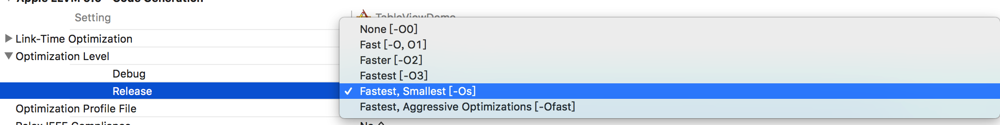
</div>

- `None[-O0]`: 编译器不会优化代码，意味着更快的编译速度和更多的调试信息，默认在 Debug 模式下开启。
- `Fast[-O,O1]`: 编译器会优化代码性能并且最小限度影响编译时间，此选项在编译时会占用更多的内存。
- `Faster[-O2]`：编译器会开启不依赖[空间/时间折衷](https://simple.wikipedia.org/wiki/Space-time_tradeoff)所有优化选项。在此，编译器不会展开循环或者函数内联。此选项会增加编译时间并且提高代码执行效率。
- `Fastest[-O3]`：编译器会开启所有的优化选项来提升代码执行效率。此模式编译器会执行函数内联使得生成的可执行文件会变得更大。一般不推荐使用此模式。
- `Fastest Smallest[-Os]`：编译器会开启除了会明显增加包大小以外的所有优化选项。默认在 Release 模式下开启。
- `Fastest, Aggressive Optimization[-Ofast]`：启动 `-O3` 中的所有优化，可能会开启一些违反语言标准的一些优化选项。一般不推荐使用此模式。

理所当然最佳的发布选项应该是：`Fastest Smallest[-Os]`，因为它极小限度会影响到包大小，而且也保证了代码的执行效率。一般 Xcode 会在 Release 下默认选择 `Fastest Smallest[-Os]` 选项，较老的项目可能没有自动勾选。

XCode 中设置的选项最终会反应在 Clang 命令上面，打开 build log 可以看到此选项最终的表现形式：

<div align="center">
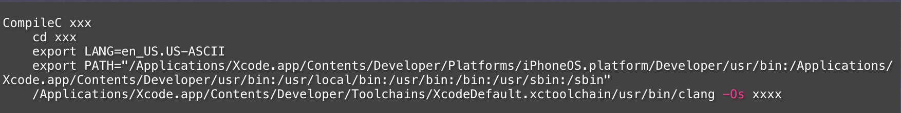
</div>

> 如果你还需要 clang 的其他选项来优化你的项目，可以在 Other C Flag 中直接添加其参数，当然也可以针在 Build Phases 中单独为某些文件设置 Compiler Flags。

### 2.1.2. Swift Complier/LLVM 编译优化选项

Swift 语言的编译器是 swiftlang，同时也是基于 LLVM 后端的。**Xcode 9.3** 版本之后 Swift 编译器会提供新的选项来帮助减少 Swift 可执行文件的大小：

<div align="center">
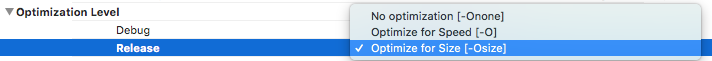
</div>

- `No optimization[-Onone]`：不进行优化，能保证较快的编译速度。
- `Optimize for Speed[-O]`：编译器将会对代码的执行效率进行优化，一定程度上会增加包大小。
- `Optimize for Size[-Osize]`：编译器会尽可能减少包的大小并且最小限度影响代码的执行效率。

Xcode 9.3 以前和优化选项混杂在一起的编译模式可以独立设置了：

<div align="center">
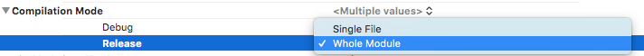
</div>

- `Single File`：单个文件优化，可以减少增量编译的时间，并且可以充分利用多核 CPU，并行优化多个文件，提高编译速度。但是对于交叉引用无能为力。
- `Whole Module`：模块优化，最大限度优化整个模块，能处理交叉引用。缺点不能利用多核 CPU 的优势，每次编译都会重新编译整个 Module。

在 Relese 模式下 `-Osize` 和 `Whole Module` 同时开启效果会发挥的最好，从现有的案例中可以看到它会减少 5%~30% 的可执行文件大小，并且对性能的影响也微乎其微（大约 5%）。参考[官方文档](https://swift.org/blog/osize/) 和 [SwiftCafe](https://swiftcafe.io/post/swift-optimization)。

此选项虽然是 Xcode 9.3 支持的，但是我们发现 Xcode 9.2 对应的 Swift Compiler 也是支持 Osize 的。所以 Xcode 9.2 版本中可以在 Build Settings -> Other Swift Flags 中添加 `-Osize` 提前获取编译器优化的好处。

<div align="center">
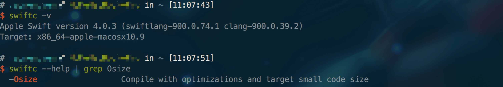
</div>

> 虽然 Xcode 9.3/Swift4.1 已经发布，但是其编译器不是特别稳定，特别是开启 Osize 选项之后，编译器很多情况下会莫名其妙的崩溃(Segmentation fault)，我们在 [bugs.swift.org](https://bugs.swift.org/browse/SR-7426?jql=labels%20%3D%20CompilerCrash) 上面也找到了很多同类的崩溃。所以假如你使开启 Osize 之后遇到了同类的崩溃，你可以选择放弃 Osize，或者想办法修改代码绕开编译器崩溃。

## 2.2. 去除符号信息

可执行文件中的[符号](https://en.wikipedia.org/wiki/Symbol_(programming))是指程序中的所有的变量、类、函数、枚举、变量和地址映射关系，以及一些在调试的时候使用到的用于定位代码在源码中的位置的调试符号，符号和断点定位以及堆栈符号化有很重要的关系。

### 2.2.1. Strip Style

`Strip Style` 表示的是我们需要去除的符号的类型的选项，其分为三个选择项：

- All Symbols: 去除所有符号，一般是在主工程中开启。
- Non-Global Symbols: 去除一些非全局的 Symbol（保留全局符号，Debug Symbols 同样会被去除），链接时会被重定向的那些符号不会被去除，此选项是静态库/动态库的建议选项。
- Debug Symbols: 去除调试符号，去除之后将无法断点调试。

iOS 的调试符号是 DWARF 格式的，相关概念如下：

- [Mach-O](https://en.wikipedia.org/wiki/Mach-O): 可执行文件，源文件编译链接的结果。包含映射调试信息(对象文件)具体存储位置的 Debug Map。
- [DWARF](https://en.wikipedia.org/wiki/DWARF)：一种通用的调试文件格式，支持源码级别的调试，调试信息存在于 [对象文件](https://en.wikipedia.org/wiki/Object_file) 中，一般都比较大。Xcode 调试模式下一般都是使用 DWARF 来进行符号化的。
- dSYM：独立的符号表文件，主要用来做发布产品的崩溃符号化。dSYM 是一个压缩包，里面包含了 DWARF 文件。

<div align="center">
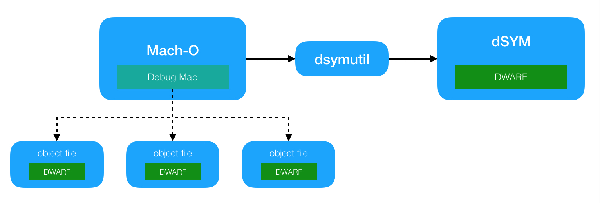
</div>

使用 Xcode 编译打包的时候会先通过可执行文件的 Debug Map 获取到所有对象文件的位置，然后使用 [dsymutil](https://llvm.org/docs/CommandGuide/dsymutil.html) 来将对象文件中的 DWARF 提取出来生成 dSYM 文件。

### 2.2.2. Strip Linked Product

> If enabled, the linked product of the build will be stripped of symbols when performing deployment postprocessing.

并不是所有的符号都是必须的，比如 Debug Map，所以 Xcode 提供给我们 Strip Linked Product 来去除不需要的符号信息(Strip Style 中选择的选项相应的符号)，去除了符号信息之后我们就只能使用 dSYM 来进行符号化了，所以需要将 Debug Information Format 修改为 DWARF with dSYM file。

我之前一直疑惑没有 DWARF 调试信息之后 Xcode 是靠什么来生成 dSYM 的，答案其实还是 DWARF，因为 Xcode 编译实际的操作步骤是：生成带有 DWARF 调试信息的可执行文件 -> 提取可执行文件中的调试信息打包成 dSYM -> 去除符号化信息。去除符号是单独的步骤，使用的是 `strip` 命令。

另外一个问题是，去除符号化信息之后我们只能使用 dSYM 来进行符号化，那我们使用 Xcode 来进行调试的时候会不会太麻烦了？其实我们完全不用担心这个问题：`Strip Linked Product` 选项在 `Deployment Postprocessing` 设置为 YES 的时候才生效，而在 Archive 的时候 Xcode 总是会把 `Deployment Postprocessing` 设置为 YES 。所以我们可以打开 `Strip Linked Product` 并且把 `Deployment Postprocessing` 设置为 NO，而不用担心调试的时候会影响断点和符号化，同时打包的时候又会自动去除符号信息。这个选项也是默认打开的，较老的项目可以选择手动开启。
 
### 2.2.3. Strip Debug Symbols During Copy

> Specifies whether binary files that are copied during the build, such as in a Copy Bundle Resources or Copy Files build phase, should be stripped of debugging symbols. It does not cause the linked product of a target to be stripped—use Strip Linked Product (STRIP_INSTALLED_PRODUCT) for that.

与 `Strip Linked Product` 类似，但是这个是将那些拷贝进项目包的三方库、资源或者 Extension 的  Debug Symbol 去除掉，同样也是使用的 strip 命令。这个选项没有前置条件，所以我们只需要在 Release 模式下开启，不然就不能对三方库进行断点调试和符号化了。

如果依赖的 Target 是独立签名的（比如 App Extension），strip 操作就会失效，并伴随着 Warning：`warning: skipping copy phase strip, binary is code signed: xxxx`。此情况将依赖的 Target 中的 Strip Linked Product 修改为 YES，保证依赖的 Target 是已经去除了符号即可，Waning 忽略掉就可以了。

> Cocoapods 管理的动态库(use_framework!)的情况就相对要特殊一点，因为 Cocoapods 中的的动态库是使用自己实现的脚本 `Pods-xxx-frameworks.sh` 来实现拷贝的，所以并不会走 Xcode 的流程，当然也就不受 Strip Debug Symbols During Copy 的影响。当然 Cocoapods 是源码管理的，所以只需要将源码 Target 中的 Strip Linked Product 设置为 YES 即可。

### 2.2.4. Strip Swift Symbols

> Adjust the level of symbol stripping specified by the STRIP_STYLE setting so that when the linked product of the build is stripped, all Swift symbols will be removed.

开启 `Strip Swift Symbols` 能帮助我们移除相应 Target 中的所有的 Swift 符号，这个选项也是默认打开的。

补充一点：Swift ABI 稳定之前，Swift 标准库是会打进目标文件的，想要同时移除 Swift 标准库里面的符号的话需要在[发布选项](http://help.apple.com/xcode/mac/current/#/devde46df08a)中勾选 `Strip Swift symbols`，如下图所示：

<div align="center">
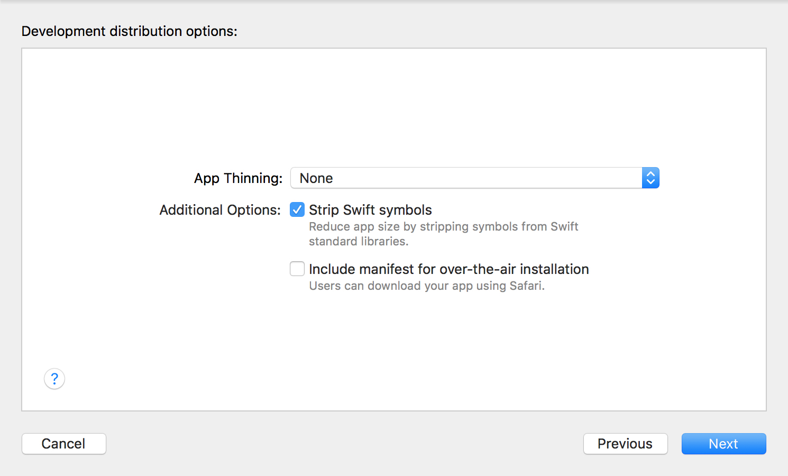
</div>

## 2.3. BitCode

BitCode 是 iOS 9 引入的新特性，官方文档解释 BitCode 是一种程序中间码，其实就是 LLVM IR 的一种编码形式 - [BitCodeFormat](https://llvm.org/docs/BitCodeFormat.html)。

<div align="center">
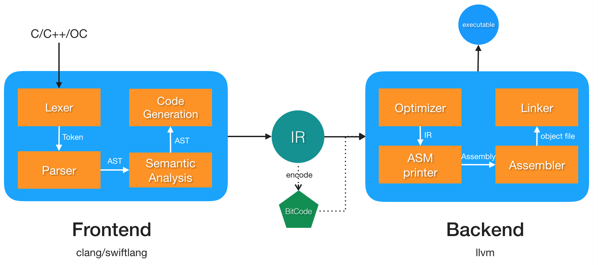
</div>

上图表示了 IR 和 BitCode 在编译器架构中所在的位置，需要说明的是 BitCode 是以 section 形式保存在可执行文件中。当我们把携带 BitCode 的 App 提交到 AppStore 后，苹果会提取出可执行文件中的 BitCode 段，然后针对不同的 CPU 架构编译和链接成不同的可执行文件变体(Variant)，不同 CPU 架构的设备会自动选择合适的架构的变体进行下载。而在 BitCode 之前没我们都是把所有需要的 CPU 架构集合打包成一个 [Fat Binary](https://en.wikipedia.org/wiki/Fat_binary)，结果就是用户最终下载的安装包之中有很多冗余的 CPU 架构支持代码。

从以上编译器架构中我们也可以得出一个结论：**开启 BitCode 之后编译器后端(Backend)的工作都由 Apple 接管了**。所以假如以后苹果推出了新的 CPU 架构或者以后 LLVM 推出了一系列优化，我们也不再需要为其发布新的安装包了。

### 2.3.1. BitCode 一致性要求

一致性要求意味着工程开启 BitCode 之后必须要求所有打进 Bundle 的 Binary 都需要支持 BitCode，也就是说我们依赖的静态库和动态库都是含有 BitCode 的，不然就会打包失败。对于 Cocoapods 等源码管理工具来管理的依赖库来说操作会比较简单，我们只需要开启 Pods 工程中的 BitCode 就行。但是对于一些三方的闭源库，我们就无能为力了。

### 2.3.2. BitCode 的崩溃定位

开启 BitCode 之后需要特别注意[崩溃定位的问题](https://docs.fabric.io/apple/crashlytics/missing-dsyms.html)：由于最终的可执行文件是 Apple 自动生成的，同时产生新的符号表文件，所以我们使用原本打包生成的 dSYM 符号化文件是无法完成符号化的。所以我们需要在上传至 App Store 时需要勾选 `Include app symbols for your application to receive symboilcated crash logs from Apple`：

<div align="center">
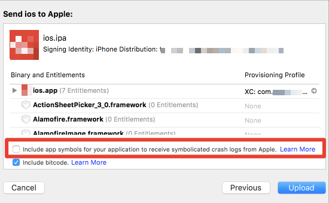
</div>

勾选之后 Apple 会给我们生成 dSYM，然后就可以在 Xcode -> Organizer 或者 iTunes Connect 中下载对应的 dSYM 来进行符号化了。

### 2.3.3. BitCode 的编译选项优化

上面所说的[编译器优化](#21-编译器优化)是在编译器前端完成的，所以提交的 BitCode 应该是经过优化的。但是 [去除符号信息](#22-去除符号信息)，是在编译生成可执行文件之后完成的， 苹果在生成可执行文件之后是否给我们去除了符号也不得而知。

## 2.4. 清理无用代码

### 2.4.1. Dead Code Stripping

> Activating this setting causes the `-dead_strip` flag to be passed to ld(1) via cc(1) to turn on dead code stripping. Remove functions and data that are unreachable by the entry point or exported symbols

Xcode 默认会开启此选项，C/C++/Swift 等静态语言编译器会在 link 的时候移除未使用的代码，但是对于 Objective-C 等动态语言是无效的。因为 Objective-C 是建立在运行时上面的，底层暴露给编译器的都是 Runtime 源码编译结果，所有的部分应该都是会被判别为有效代码。

### 2.4.2. 通过扫描查找无用代码

扫描无用代码的基本思路都是查找`已经使用的方法/类`和`所有的类/方法`，然后从`所有的类/方法`当中剔除`已经使用的方法/类`剩下的基本都是`无用的类/方法`，但是由于 Objective-C 是动态语言，可以使用字符串来调用类和方法，所以检查结果一般都不是特别准确，需要二次确认。目前市面上的扫描的思路大致可以分为 3 种：

- 基于 Clang 扫描
- 基于可执行文件扫描
- 基于源码扫描

#### 2.4.2.1. 基于 clang 扫描

基本思路是基于 clang AST。追溯到函数的调用层级，记录所有定义的方法/类和所有调用的方法/类，再取差集。具体原理参考 [如何使用 Clang Plugin 找到项目中的无用代码](http://blog.gocy.tech/2017/09/12/DetectingUselessCodeWithClang-p1/)，目前只有思路没有现成的工具。

#### 2.4.2.2. 基于可执行文件扫描

Mach-O 文件中的 `(__DATA,__objc_classlist)` 段表示所有定义的类， `(__DATA.__objc_classrefs)` 段表示所有引用的类(继承关系是在 `__DATA.__objc_superrefs` 中)；使用的方法和引用的方法也是类似原理。因此我们使用 otool 等命令逆向可执行文件中引用到的类/方法和所有定义的类/方法，然后计算差集。具体参考[iOS微信安装包瘦身](http://www.cocoachina.com/ios/20151211/14562.html)，目前只有思路没有现成的工具。

#### 2.4.2.3. 基于源码扫描

一般都是对源码文件进行字符串匹配。例如将 `A *a`、`[A xxx]`、`NSStringFromClass("A")`、`objc_getClass("A")` 等归类为使用的类，`@interface A : B` 归类为定义的类，然后计算差集。

`基于源码扫描` 有个已经实现的工具 - [fui](https://github.com/dblock/fui)，但是它的实现原理是`查找所有 #import "A" 和所有的文件进行比对`，所以结果相对于上面的思路来说可能更不准确。

#### 2.4.2.4. 通过 AppCode 查找无用代码

[AppCode](https://www.jetbrains.com/help/objc/code-inspection.html)  提供了 Inspect Code 来诊断代码，其中含有查找无用代码的功能。

<div align="center">
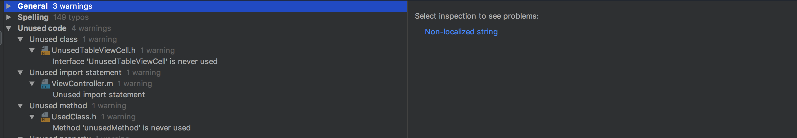
</div>

它可以帮助我们查找出 AppCode 中`无用的类`、`无用的方法`甚至是`无用的 import` ，但是无法扫描通过字符串拼接方式来创建的类和调用的方法，所以说还是上面所说的 [基于源码扫描](#2423-基于源码扫描) 更加准确和安全。

> 通过扫描的方式去检查无用代码有个痛点就是 `类的方法调用是一种引用关系`，以上所说的四种思路都是查找到`引用末端`的未使用的代码，我们很难通过一次扫描就定位到所有未使用的类，自动化实现起来也较难。举个例子来说，假如 A 是一个未使用到的类，但是 A 引用了 B，所以首次检查结果是 A 未被引用，B 被无用类 A 引用了，我们需要把 A 删除了之后我们才能了解到 B 是否是无用的类。`当然如果你重新去实现一个引用树的话就另当别论了`。

> 由于扫描无用类实现起来较为麻烦，并且其检查结果也不是特别准确。所以建议还是让开发者养成一个良好的习惯，在迭代或者重构代码的时候把老的代码删除，不要等到量变引起质变的时候才回头去优化。

## 2.5. 重构重复代码

重复代码堆积太多，不仅意味着 [Bad Code Smell](https://en.wikipedia.org/wiki/Code_smell)，我们的包大小也会受到影响，我们可以使用 [PMD](https://pmd.github.io) 来检查项目中的重复代码，并且做选择性的重构。

## 2.6. 补充：Cocoapods 中的优化选项配置

Cocoapods 的 project 文件在每次 `pod install` 或者 `pod update` 会重置，所以需要 hook pod install 来设置 Pods 中每个 Target 的编译选项：
````ruby
post_install do |installer|
    installer.pods_project.targets.each do |target|
        target.build_configurations.each do |config|
            config.build_settings['ENABLE_BITCODE'] = 'NO'
            config.build_settings['STRIP_INSTALLED_PRODUCT'] = 'YES'
            config.build_settings['SWIFT_COMPILATION_MODE'] = 'wholemodule'
            if config.name == 'Debug'
                config.build_settings['SWIFT_OPTIMIZATION_LEVEL'] = '-Onone'
                config.build_settings['GCC_OPTIMIZATION_LEVEL'] = '0'
            else
                config.build_settings['SWIFT_OPTIMIZATION_LEVEL'] = '-Osize'
                config.build_settings['GCC_OPTIMIZATION_LEVEL'] = 's'
            end
        end
    end
end
````

# 3. 资源瘦身

本文中的资源分为图片资源、音频资源、视频资源、视图资源、字体资源、网页资源等等。资源都是**弱类型**的，会随着项目工程的增长而持续增长，维护起来费时费力，所以一般都是希望能有工具化、自动化的解决方案。

## 3.1. 图片资源瘦身

### 3.1.1. Xcode 支持

#### 3.1.1.1. Compress PNG Files

Xcode 提供的给我们两个编译选项来帮助压缩 PNG 资源：

<div align="center">
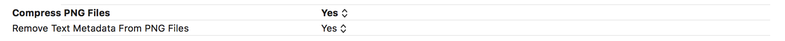
</div>

- `Compress PNG Files`：打包的时候自动对图片进行无损压缩，使用的工具为 [pngcrush](https://en.wikipedia.org/wiki/Pngcrush)，压缩比还是相当高的，比较流行的压缩软件 [ImageOptim](https://imageoptim.com/mac) 也是使用 pngcrush 进行压缩 PNG 的。

- `Remove Text Medadata From PNG Files`：能帮助我们移除 PNG 资源的文本字符，比如图像名称、作者、版权、创作时间、注释等信息。

项目引进的 PNG 资源都是自动被 Xcode 进行压缩了，所以完全不需要自己再去用工具压缩一遍。当除非你是使用 bundle 管理的资源，因为 bundle 是`直接拷贝`进项目，并不会被 Xcode 进行压缩；JPG 或者其他类型的图片资源可以使用 [ImageOptim](https://imageoptim.com/mac) 进行无损压缩然后导入到 Xcode 中，为了提高效率建议还是提供 PNG 格式的图片。

#### 3.1.1.2. App Thinning/XCAssets

iOS 9 中引入的 [App Thinning](https://help.apple.com/xcode/mac/current/#/devbbdc5ce4f) 中提到过 `Slicing` 的技术，当我们把一个完整的安装包提交给 App Store 后，App Store 会为不同的设备准备不同的变体（Variant），设备的在下载 App 的时候它能帮助我们自动选择合适的 Variant 进行下载。

可执行文件的 Slicing 技术就是上面所说的 BitCode，同样资源文件也是支持 Slicing 的。比如 iPhone 6 下载的安装包中就只会包含 2x 图，iPhone 6 Plus 下载的安装包就只会包含 3x 图，但是`只有使用 asset catelogs(也就是 XCAssets) 管理的资源才支持 Slicing`，所以尽量还是使用 XCAsset 来管理资源图片。同时 XCAsset 也支持 PDFs 矢量图，在上传到 App Store 之后，会根据矢量图自动生成 1x, 2x, 3x 图，然后进行 `Slicing`。

当然 XCAsset 也有它的存在的问题：

- 使用 XCAsset 管理的资源会被压缩并打包成一个 Asset.car 文件，我们无法获取相应图片的物理路径，因此我们无法使用 `[UIImage imageWithContentsOfFile:]` 的方式来获取图片。对于那些需要使用物理路径的方式来访问的图片，建议还是直接拖拽到 App 中进行管理。

- iOS 10.3 推出的更换 App Icon 的资源文件只能放在 App 根目录下进行管理。

- 使用 XCAsset 管理图片后，Xib/Storyboard 中设置的带后缀 .png 图片在 Interface Builder 是不可见的，都是显示的问号，但是运行起来是没有问题的。最好的做法是全局搜索并去掉后缀保证更好的开发体验。

### 3.1.2. 去除冗余图片资源

#### 3.1.2.1. 去除无用资源

未使用的资源可以使用脚本来进行删除。强烈推荐使用 [FengNiao](https://github.com/onevcat/FengNiao) 来自动删除图片，因为其相对比较新，是 2017 年开始开发的，并且是使用 swift 语言开发的，方便进行二次开发。FengNiao 的基本原理是查找出`项目中所有使用到的字符串`和`项目中所有的资源文件`。两者进行匹配（完全匹配和模式匹配，模式匹配支持带数字资源的前缀/中缀/后缀匹配），计算差集就为未使用的资源。

相比于之前流行的 [LSUnusedResources](https://github.com/tinymind/LSUnusedResources)，FengNiao 支持模式匹配会更加强大：比如我们导入 `image_01` `image_02` `image_03` 这样的图片资源作为帧动画素材，使用的时候是 `image_%d` 或者 `image_\(index)` 方式，FengNiao 会把这些图片资源作为使用中的资源，不会出现误删的情况。当然如果你还是用了其他 Pattern，可以考虑扩展 FengNiao。

除了这些之外，FengNiao 是命令行工具，我们可以给 Xcode 添加 Run Script，在每次构建的时候自动检测/清理未使用的资源。

> 由于基于源码的扫描工具结果不是百分百准确的，所以建议最好的做法是在项目编译的时候提供出显式的 Warning，然后再次确认之后再去删除。同时也可以配合资源命名规范来优化工具，如果你们的命名规范和工具的检测规范能够保持一致的话，搜索的结果无疑是最为准确的。

> 之所以要使用自动化工具来检测重复资源的原因是因为资源是**弱类型**，我们在项目迭代过程中手动去维护是相当麻烦的一个过程。转换一下思维，如果资源变成**强类型**了，那我们维护起来就相当容易了。目前就有这样一个工具-[R.swift](https://github.com/mac-cain13/R.swift)，类似于 Android 开发中的 R 文件，有兴趣的可以去尝试。

#### 3.1.2.2. 去除重复资源

这里所说的重复资源是资源内容相同但是命名不相同的一些资源，对于此类资源，我们可以使用 [fdupes](https://github.com/adrianlopezroche/fdupes) 来进行扫描并去除，fdupes 的原理是对比不同文件的签名，签名相同的文件就会判定为重复资源。

然后我们就可以在 Xcode 中添加 Run Script，对于扫描到的相同的资源，我们可以显式的报出 Warning，然后我们在开发阶段解决资源重复的问题。

### 3.1.3. On-Demand Resources

[On-Demand Resources](https://developer.apple.com/library/content/documentation/FileManagement/Conceptual/On_Demand_Resources_Guide/) 是 Apple 在 iOS 9 跟 App Thinning 一起引进的一项减少安装包体积技术，大致的概念是苹果帮你把所有 App 中的资源管理在 App Store 云端上，然后你需要把资源标记为不同的 Tag，需要的时候才去下载相应 Tag 的图片。引用苹果文档中的一张图表示。

<div align="center">

</div>

这种机制对于许多图片资源都放在本地的 App 就会比较有用，比如游戏中的不同关卡可以分为不同的 tag，在用户通关了一关之后才下载下一关资源。

## 3.2. 视频/音频图片资源远端化

视频/音频等图片资源相对图片来说会大很多，所以建议把视频/音频放在服务端，客户端在使用的时候进行下载或者使用流播放。

## 3.3. HTML5 远端化

H5 资源也是建议放在服务端，如果对 H5 加载和离线访问有要求的话，可以使用离线缓存的方式来缓存网页资源到本地。

## 3.4. 视图资源

这里所说的视图资源是指 xib/storyboard。xib 在打包时会被压缩为 nib 文件，storyboard 文件会被压缩为 storyboardc 文件，storyboardc 是个压缩包，内部包含了相应的 nib 和 一个 plist 文件。一般的 nib 文件压缩后在几 KB 到几十 KB 大小，这部分包大小的影响相对于 xib 能提高开发效率来说影响是微乎及微的，网易漫画 App 中使用到了 257 个 xib 文件，但是其在 payload 中的数据仅仅只有 1.7M 大小。

# 4. Framework

Framework 文件夹存放的是 [Embedded Framework](https://developer.apple.com/library/content/technotes/tn2435/_index.html)。Embedded Framework 一般都是指动态库（Mach-O Type 标记为 Dynamic Library 的 Framework），它在打包的时候最终会被拷贝进 Target App Bundle 中的 Framework 文件夹中，在 App 启动的时候才会被链接和加载。Embedded Framework 主要分类两类：

- `SwiftSupport`：Framework 文件夹中前缀是 `libSwift` 的一些 framework。由于目前 [Swift ABI](https://github.com/apple/swift/blob/master/docs/ABIStabilityManifesto.md) 还未稳定，我们发布应用的时候还需要带上一份自己应用中使用到的 Swift 标准库代码，这部分占用最终 ipa 的大小可能在 10M 左右。
- `其他依赖库`：使用 Cocoapods 管理依赖并且设置了 `user_framework!` 时三方库源码都会打包成 dynamic framework，然后导入到工程当中。

## 4.1. Framework 中的资源

> 这里所说的 Framework 表示的是: 静态库(.a) Framework(Static Library) 和 Framework (Dynamic Library)

目前绝大部分的 Framework 的做法是直接将资源放进 bundle 中进行管理的，在主工程打包的时候，Xcode 会将这部分资源`直接拷贝`进 App Target Bundle 中，这样做就存在2个问题：

- 使用 bundle 管理的资源是不会被 Xcode 优化的(图片压缩等)
- 使用 bundle 管理的资源不享受 App Thinning/Slicing。

所以尽量还是选择 XCAsset 进行 Framework 的资源管理，静态库和动态库的管理方式有所不同：

- 静态库(.a)/Framework(Static Library): 静态库的目标文件(.a/.framework) 中是不能包含资源文件的，所以这部分只能使用 bundle 来管理。但是由于 bundle `直拷贝`的特性，我们需要把 xib/storyboard/asset catalog 编译后的产物(nib/storyboardc/Asset.car)放进 bundle 里。比较普遍的一个做法是借助 Bundle Target 来编译我们的资源文件，具体做法看[这篇文章](http://jaym2503.blogspot.jp/2014/03/how-to-create-resource-bundle-in-ios.html)。

- 动态库: 动态库相对来说要简单一点，因为动态库本身就是一个 bundle。所以我们直接把资源文件放在目标文件(.framework)中就可以了。

> 如果你是使用 [Cocoapods](https://cocoapods.org/) 管理你的源码，也可以使用 XCAsset 来管理资源，参考 [在 Cocoapods 中使用 XCAsset](https://stackoverflow.com/questions/32577227/how-to-use-images-asset-catalog-in-cocoapod-library-for-ios)。

## 4.2. Framework 中的可执行文件

这部分可以参考以上的[可执行文件瘦身](#2-可执行文件瘦身)。

# 5. Plugins

Plugin 内部主要存放的就是 [App Extension](https://developer.apple.com/library/content/documentation/General/Conceptual/ExtensibilityPG/index.html)，App Extension 是独立打包签名，然后再拷贝进 Target App Bundle 的。

## 5.1. Plugin 中的静态库

静态库最终会打包进可执行文件内部，所以如果 App Extension 依赖了三方静态库，同时主工程也引用了相同的静态库的话，最终 App 包中可能会包含两份三方静态库的体积。

## 5.2. Plugin 中的动态库

动态库是在运行的时候才进行加载链接的，所以 Plugin 的动态库是可以和主工程共享的，把动态库的加载路径 Runpath Search Paths 修改为跟主工程一致就可以共享主工程引入的动态库。

<div align="center">
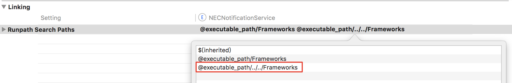
</div>

## 5.3. Plugin 中的 Swift Standard Library

在 Swift ABI 稳定之前，Swift 标准库会被拷贝进 App 当中。Swift 标准库是动态链接库，也是可以在主工程和其他的 App Extensions 之间共享的，前提当然是所有 Target 使用的 Swift 版本是一致的，否则就会出现意料之外的 bug。
设置共享分为两步：

- 设置 Extension 中的 `Always Embed Swift Standard Libraries` 为 NO，让编译器不再为 Extension 生成 Swift 标准库
<div align="center">
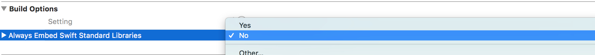
</div>

- 设置 Extension 中的动态库的查找路径为主工程的 Framework 文件夹

</div>

# 6. 在网易漫画中的实践

我们在网易漫画 App 中逐渐进行了实践，此次主要进行的是可执行文件的瘦身：编译优化以及去除符号；资源瘦身：冗余资源清除以及主工程图片分片（App Thinning）。下面是优化前后的部分数据：

|  | 优化前 | 优化后 | 效果 |
| ---- | ---- | ---- | ----- |
| Executable | 35.4M | 17.1M | 52.1% |
| Embedded Framework(除去 Swift STL) | 27.8M | 19M | 31.7% |
| Images(FengNiao) | 13.3M | 11.7M | 12% |

Executable 的数据显示的比较夸张的主要原因是我们在做瘦身的时候同时去除了之前使用到的直播 SDK，实际可执行文件的提升效果应该也在 30% 左右。IPA 文件从最初的 70+M 到现在 39.4M，总的来说效果还是相当明显。

当然以上并非此次瘦身的全部内容，Framework 瘦身，冗余代码清除等比较难的点后续也会陆续展开实践，同时也会在本文中进行更新。

# 7. 结论

- 将 Build Settings -> Clang/LLVM Generate Code -> Optimize Level 设置为 Fastest, Smallest(-Os)。
- 将 Build Settings -> Swift/LLVMGenerate Code -> Optimize Level 设置为 Optimize for Size(-Osize)。
- 将 Build Settings -> Strip Linked Product 和 Strip Swift Symbols 设置为 YES，Deployment Postprocessing 设置为 NO，发布代码的时候也需要勾选 Strip Swift Symbols。
- Strip Debug Symbols During Copy 在 Release 模式下设置为 YES。
- 有条件的话，适配 BitCode。
- 无论在主工程或者 Framework 中都使用 XCAsset 来管理资源。
- 使用工具扫描删除无用资源，推荐选择 [FengNiao](https://github.com/onevcat/FengNiao)，并添加 Run Scripts。
- 使用工具扫描重复资源，推荐选择 [fdupes](https://github.com/adrianlopezroche/fdupes)，并添加 Run Scripts。
- 如果你大量资源都放在本地，推荐使用 [On-Demand Resources](https://developer.apple.com/library/content/documentation/FileManagement/Conceptual/On_Demand_Resources_Guide) 方式来管理资源。
- 在 Swift ABI 稳定之前 Extension 和主 App 之间共享 Swift Standard Libraries。
- 开启 Compress PNG Files/Remove Text Metadata From PNG Files。
- 将 Dead Code Stripping 设置为 YES。
- 使用工具扫描和清理无用代码，同时养成良好习惯，在迭代或者重构的时候删除旧的代码。
- 使用工具扫描重复代码并重构它。
- 视频/音频/H5 等资源远端化。
- 使用 xib/storyboard 来开发视图界面会一定程序增加安装包的大小。
- 使用 Swift 来开发程序会一定程序增加安装包的大小，对包大小有严格要求的话也可以衡量是否使用 Swift。
- 如果你对包大小有严格要求的话，选择合适大小的三方库来进行开发。

# 8. Reference

- https://juejin.im/post/5800ef71a0bb9f0058736caa
- http://www.cocoachina.com/ios/20151211/14562.html
- https://swiftcafe.io/post/swift-optimization
- http://blog.cnbang.net/tech/2544/